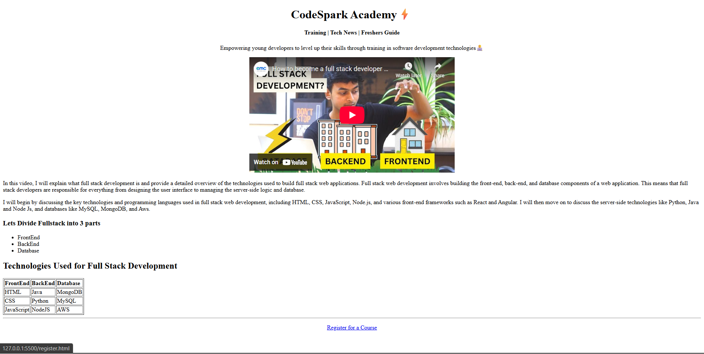
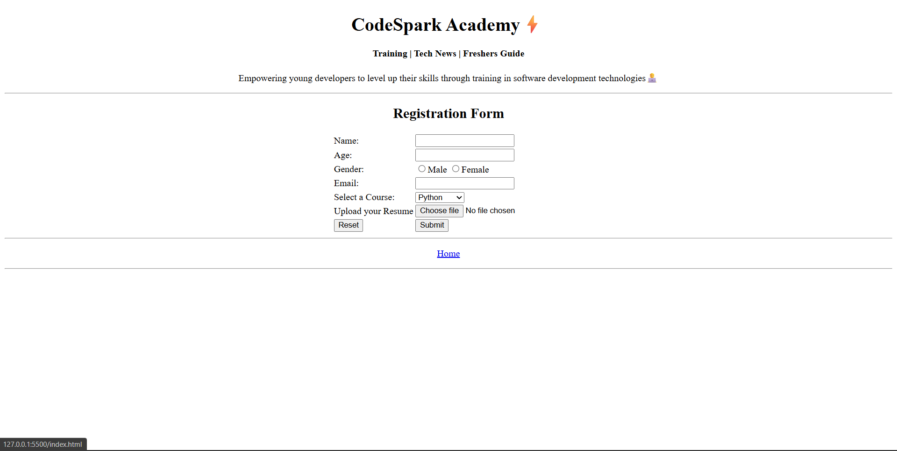

# CodeSpark Academy – HTML Practice Project 

This is a **beginner-level, multi-page website** built using **pure HTML** as part of learning web development fundamentals.  
The project demonstrates basic webpage structure, forms, tables, links, and content organization.


## 📖 Note

This project was inspired by an online tutorial and customized as part of my HTML learning journey.


## 📌 Project Overview

CodeSpark Academy is a simple static website prototype that includes:
- A home page introducing the academy
- An overview of full stack development concepts
- A registration form for course enrollment

The main goal of this project is to practice **HTML fundamentals** and understand how real-world websites are structured.


## 🛠️ Technologies Used

- HTML5
(No CSS or JavaScript used — focus is on core HTML concepts)


## 📂 Project Structure

codespark-academy-html-practice/
│
├── index.html
└── register.html


## 🎯 Learning Objectives
- Understand basic HTML page structure
- Use headings, paragraphs, lists, and tables
- Create forms with different input types
- Link multiple HTML pages together
- Embed external media (YouTube iframe)


## 🚀 How to Run the Project

1. Clone the repository:
   ```bash
   git clone https://github.com/dinishsg/academy-website-html.git
2. Open index.html in any web browser.


## 📸 Screenshots





## 🌐 Live Demo

🔗(https://dinishsg.github.io/academy-website-html/)
